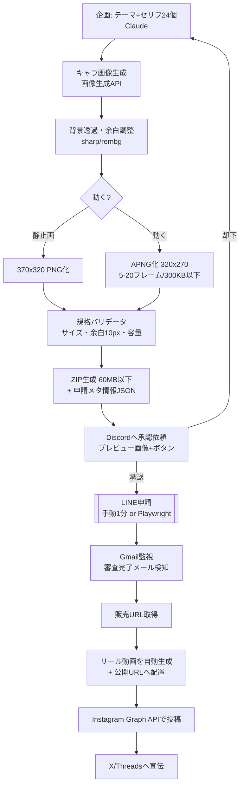

# LINEスタンプ自動化：実現可能性チェックと設計メモ

参照元：X投稿（@umino_chibi / 2026-09-03）
「LINEスタンプ制作を自動化して、動くスタンプを1セット約300円で作れるようにした。
Discordで承認依頼を投げ、LINE審査通過次第自動でインスタリールへ投稿。Grokで動画生成し、コストを大幅削減。」

調査日：2026-09-03

---

## 1. 結論

**ほぼ全部できる。ただし1か所だけ完全自動化できない＝「LINEへの申請アップロード」。**

LINE Creators Market には申請用の公開APIが存在しない（LINE Developersにあるのは Messaging API 等で、スタンプ申請とは別物）。
つまり投稿主のフローも、どこかで「人がマイページで申請ボタンを押す」か「ブラウザ自動操作（Playwright等）」のどちらかになっている。

| 工程 | 自動化 | 手段 |
|---|---|---|
| ① テーマ・セリフ40個の企画 | ◎ 全自動 | Claude / LLM |
| ② キャラ静止画の生成（透過PNG） | ◎ 全自動 | 画像生成API＋背景透過 |
| ③ 動くスタンプ化（APNG） | ◎ 全自動 | ffmpeg / apngasm（下記ルートA推奨） |
| ④ 規格チェック・リサイズ・ZIP化 | ◎ 全自動 | sharp / pngquant のスクリプト |
| ⑤ Discordで承認依頼→承認受付 | ◎ 全自動 | Discord Webhook＋Bot |
| ⑥ **LINEへ申請** | △ **半自動** | **公開APIなし。人が押す or ブラウザ自動操作** |
| ⑦ 審査通過の検知 | ◎ 全自動 | Gmail監視（do_not_reply@line.me からのメール） |
| ⑧ 通過後、インスタリールへ自動投稿 | ◎ 全自動 | Instagram Graph API（media_type=REELS） |
| ⑨ X / Threads へ宣伝投稿 | ◎ 全自動 | 各API（Threadsは既存スキル流用可） |
| ⑩ 売上の記録・分析 | ◎ 全自動 | 分配額確定メール＋マイページ |

⑥について現実的な推奨：**ZIPと申請文まで全自動で用意して、申請ボタンだけ人が押す（1セット1分）。**
ブラウザ自動操作でも技術的には動くが、規約上グレーかつ画面変更で壊れるので、まずは半自動で回して量が増えたら検討。

---

## 2. 全体パイプライン



---

## 3. 各工程の中身

### ②③ 画像・アニメーション生成（ここがコストの本体）

**LINEの規格（要点）**
- 静止画スタンプ：最大 370×320px / PNG・背景透過 / 8・16・24・32・40個から選択
- 動くスタンプ：最大 320×270px（縦横どちらかが270px以上必要）/ **APNG形式（拡張子.png）** / 5〜20フレーム / 再生1〜4秒 / ループ1〜4回 / **1ファイル300KB以下** / 8・16・24個
- メイン画像 240×240、トークルームタブ画像 96×74
- ZIP一括アップロードは60MB以下
- 画像の周囲に10px程度の余白が必要（リジェクト対策）

**アニメ化は2ルートある。ここが投稿主との分かれ目。**

- **ルートA（推奨）：静止画1枚 → プログラムでアニメーション**
  ぷるぷる揺れ／ジャンプ／瞬き／文字ポップ などを ffmpeg・sharp の変形で生成してAPNG化。
  - 追加コスト **0円**（計算だけ）
  - **背景透過が完全に保てる**（動画生成では保てない）
  - フレーム数・容量を数値で制御できるので300KB以下が確実
  - 弱点：動きのバリエーションがテンプレ的

- **ルートB（投稿主の方式）：Grok Imagine Video で動画生成 → フレーム分解 → 背景除去 → APNG**
  - Grok Imagine Video は API 提供あり（480p $0.05/秒 〜 720p $0.07/秒、1〜15秒、text/image/reference-to-video）
  - 追加コスト：24個×2秒×$0.05 ＝ 約$2.4（≒360円）
  - 弱点：**動画は背景透過で出てこない**。フレームごとに背景除去するとフチがチラつき、審査リジェクトの原因になりやすい。300KB制約も厳しい

→ **まずルートAで量産の型を作り、動きに凝りたいセットだけルートBを使う**のが安くて安全。

### ④ 規格バリデータ

申請前に機械チェックを通すのが、この自動化のいちばん効く部分（リジェクトで往復すると1回で数日ロス）。
- 画素サイズ／偶数ピクセル／余白10px／アルファチャンネル有無
- APNGのフレーム数・総再生時間・ループ回数・**容量300KB**（超えたら pngquant で自動減色→再チェックのループ）
- 個数が 8/16/24 のいずれかになっているか
- ZIP合計60MB以下

### ⑤ Discord承認

Webhookでプレビュー（24個のコンタクトシート画像）＋セリフ一覧を投げ、リアクションかボタンで承認/却下。
却下理由をそのまま①の再生成プロンプトに戻す。Botトークンは承認ボタンを使う場合に必要。

### ⑦ 審査通過の検知

LINEは `do_not_reply@line.me` から審査結果・分配額のメールを送ってくる（既存の受信履歴あり）。
Gmail連携で件名を監視 → 通過を検知 → 販売URLを取得。
※スクレイピングより先にメール監視。こちらは完全に正攻法。

### ⑧ インスタリール自動投稿

- Instagram Graph API の Content Publishing：`POST /{ig-user-id}/media` に `media_type=REELS` と **公開URLの動画**を渡す → `status_code` が FINISHED になるまでポーリング → `POST /{ig-user-id}/media_publish`
- 要件：Instagramプロアカウント＋Facebookページ連携＋Metaアプリ＋`instagram_business_content_publish` 権限（アプリレビュー必須）
- リール条件：9:16 / 5〜90秒 / H.264
- 上限：APIからの投稿は 1アカウント24時間あたり100件
- 動画は「公開URL」に置く必要があるので、Cloudflare R2 / Pages などに一時置き場を作る

---

## 4. コスト試算（1セットあたり）

| 内訳 | ルートA（プログラムアニメ） | ルートB（Grok動画） |
|---|---|---|
| セリフ・企画（LLM） | 〜10円 | 〜10円 |
| キャラ画像 24枚（$0.02/枚） | 約72円 | 約72円 |
| 動画生成 | 0円 | 約360円（24個×2秒×480p） |
| APNG変換・検査 | 0円 | 0円 |
| リール動画生成 | 0〜30円 | 0〜30円 |
| **合計** | **約100円／24個セット** | **約450〜550円／24個セット** |

投稿主の「1セット約300円」は、8〜16個セット＋短尺の動画生成ならだいたい整合する数字。
**24個セットでもルートAなら100円前後まで落ちる。**

※ 上記はAPI料金のみ。LINE側の申請費用は無料、売上はLINEの分配率に従って入金（既に送金申請ページあり）。

---

## 5. 登録が必要なものチェックリスト

### すでに持っている（新規登録不要）
- [x] **LINE Creators Market アカウント** — 2022年から販売実績あり（分配額確定メール受信、未払い分配額¥229）
      → やること：マイページで**送金先銀行口座と分配金設定の確認**だけ
- [x] **Meta開発者アカウント＋アプリ**（「インスタ自動連携ツール」アプリID: 734842121388086 / ビジネスID: 1124911297871023）
- [x] **Discordアカウント**
- [x] **Cloudflareアカウント**（このリポジトリで Pages/Wrangler を使用中）
- [x] **Gmail**（Claude連携済み → 審査完了メール検知に使える）

### 新規に必要
1. **xAI（Grok）APIキー** — https://console.x.ai で登録＋クレカ登録＋クレジット購入
   （※ルートAで進めるなら画像生成だけでOK。他の画像生成APIでも代替可）
2. **Instagram プロアカウント（ビジネス/クリエイター）＋Facebookページ連携** — 未設定なら設定
3. **Metaアプリの権限追加：`instagram_business_content_publish` のアプリレビュー申請**
   — 審査に数日〜2週間。**ここが一番リードタイムが長いので最初に出す**
4. **Discordサーバー＋Webhook URL**（承認ボタンを使うならBotも作成）— 実質5分
5. **動画・画像の公開置き場**（Cloudflare R2バケット or Pagesの一時ディレクトリ）
6. **実行環境の決定** — GitHub Actions（無料枠）or 手元PCの常駐。
   ※このClaude実行環境（クラウド）からは `creator.line.me` へのアクセスがネットワークで遮断されているため、
   LINE絡みの処理は**手元PCかGitHub Actionsで動かす前提**にする。

### 環境変数（.env に入れるもの）
```
XAI_API_KEY=
DISCORD_WEBHOOK_URL=
DISCORD_BOT_TOKEN=        # 承認ボタンを使う場合
IG_USER_ID=
IG_ACCESS_TOKEN=          # 長期トークン（60日ごとに更新）
FB_PAGE_ID=
R2_ACCOUNT_ID= / R2_ACCESS_KEY= / R2_SECRET=   # 動画置き場
```

---

## 6. 規約・リスクの注意点

- **LINE申請の自動化（ブラウザ操作）はグレー。** 公式APIがない領域を機械操作するので、まずは申請ボタンだけ手動が安全。
- **AI生成画像そのものはNGではない**が、他者の著作物・実在人物・既存キャラに似ていると審査で落ちる。生成プロンプトに「特定の作品名・人物名を入れない」ルールを組み込む。
- **量産のしすぎはリジェクト・アカウント停止リスク。** 1日あたりの申請本数に上限を設ける（例：1日2セットまで）。
- **審査は数時間〜2日程度。** 通過前提でリール投稿を組まず、必ず⑦の検知を待つ（投稿主のフローも同じ思想）。
- **Instagram APIは24時間100投稿上限**、アクセストークンは期限切れするので更新処理を入れる。
- リールに使う動画は「公開URL」が必要なので、置き場は投稿完了後に自動削除する。

---

## 7. 次にやること（フェーズ分け）

**Phase 0（登録・所要1〜2時間＋審査待ち）**
- Metaアプリの `instagram_business_content_publish` レビュー申請を出す（リードタイム最長なので最初）
- xAI APIキー取得、Discord Webhook作成

**Phase 1（一番効くところ・オフラインで完結）**
- セリフ企画 → 画像生成 → 透過 → APNG化 → **規格バリデータ → ZIP** までのCLIを作る
- これだけで「1セット100円で申請ZIPが出てくる」状態になる（LINE申請は手動1分）

**Phase 2**
- Discord承認フローを追加（生成→承認→ZIP確定）

**Phase 3**
- Gmail監視で審査通過検知 → リール動画生成 → Instagram自動投稿 → X/Threads宣伝

**Phase 4（任意）**
- 申請自体のブラウザ自動化、売上の自動集計・当たり傾向の分析

---

## 参考リンク

- LINE Creators Market 制作ガイドライン（スタンプ）: https://creator.line.me/ja/guideline/sticker/
- LINE Creators Market 制作ガイドライン（アニメーションスタンプ）: https://creator.line.me/ja/guideline/animationsticker/
- LINE Creators Market 審査ガイドライン: https://creator.line.me/ja/review_guideline/
- LINE Creators Market 利用規約: https://creator.line.me/ja/terms/
- Meta Content Publishing（Reels）: https://developers.facebook.com/documentation/instagram-platform/content-publishing
- Grok Imagine Video（料金）: https://openrouter.ai/x-ai/grok-imagine-video
